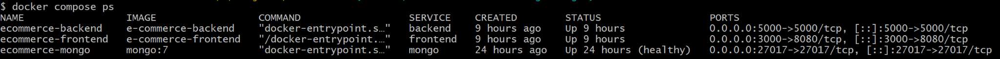
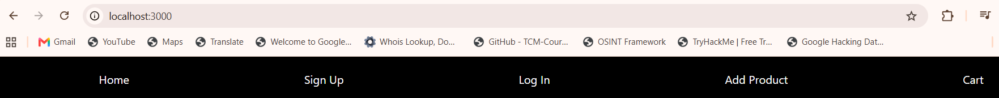
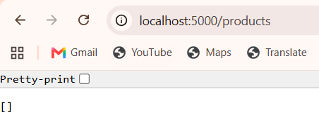
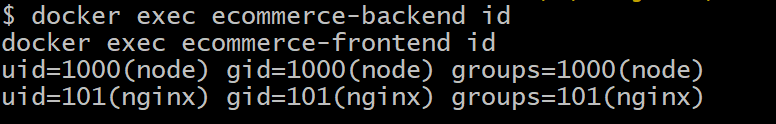
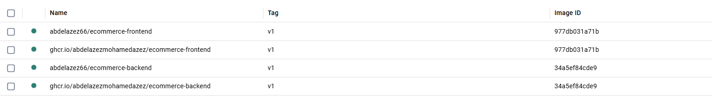
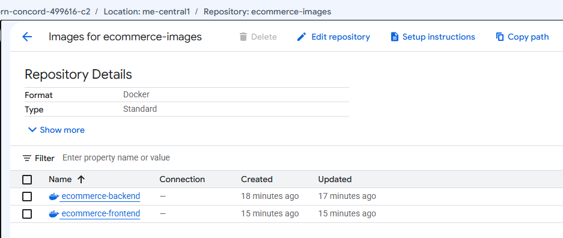

# 🛒 E-Commerce Web App

A full-stack e-commerce platform built with the MERN stack.  
It supports role-based access control, image uploads, and dynamic product management for retailers and consumers.

## 🔐 User Roles

- **Retailer**
  - Upload products with images
  - View and purchase other products
  
- **Consumer**
  - Browse products
  - Add to cart and buy items

## 🚀 Key Features

- JWT-based User Authentication
- Role-Based Access Control (RBAC)
- Image Uploads using Multer
- Product Listings with Dynamic Rendering
- Cart Functionality with Purchase Flow

## 🛠️ Tech Stack

| Area | Technology |
|------|------------|
| Frontend | React.js, Nginx |
| Backend | Node.js, Express.js |
| Database | MongoDB |
| Containerization | Docker, Docker Compose |
| Registries | Docker Hub, GitHub Container Registry, GCP Artifact Registry |

## Package Manager Support

This project supports multiple package managers:
- npm (`package-lock.json`)
- yarn (`yarn.lock`)
- pnpm (`lock.yaml`)

## 💻 Getting Started

**1. Clone the repository** 
   ```bash
   git clone "https://github.com/rutu-modha/e-commerce.git"
cd ./e-commerce
```

**2. Install dependencies**
- **using npm**
```bash
npm install
cd frontend
npm install
cd ..
cd backend
npm install
```
*OR*
- **using yarn**
```bash
yarn install
cd frontend
yarn install
cd ..
cd backend
yarn install
```
*OR*
- **using pnpm**
```bash
pnpm install
cd frontend
pnpm install
cd ..
cd backend
pnpm install
```
**3. Setup a `.env` at root file with your own Mongo_URI and JWT_SECRET variables**

**4. Run both servers**
```bash
cd ..
npm run start
```
*OR*
```bash
cd ..
yarn run start
```
*OR*
```bash
cd ..
pnpm run start
```
## 🐳 Task 6: Docker Compose Orchestration

The application is containerized as three services:

- **Frontend:** React production build served by unprivileged Nginx
- **Backend:** Node.js and Express API
- **Database:** MongoDB with persistent storage

Compose starts MongoDB first, waits for its health check, then starts the backend and waits for the backend `/health` check before starting the frontend. Every service uses `restart: unless-stopped`, the `json-file` logging driver with rotation, and the `ecommerce_network` bridge network.

### Container Architecture

```text
Browser
  |
  v
Frontend container (localhost:${FRONTEND_PORT:-3000} -> 8080)
  |
  v
Backend container (localhost:${BACKEND_PORT:-5000} -> 5000)
  |
  v
MongoDB container (localhost:${MONGO_PORT:-27017} -> 27017)
```

### Security and Optimization

- Multi-stage Dockerfiles reduce the final image size.
- The backend runs as the non-root `node` user.
- The frontend runs as the non-root `nginx` user.
- Only production frontend files are copied to the runtime image.
- Local secrets are stored in `.env` and excluded from Git.

### Docker Network and Volume

All services communicate through the custom bridge network:

```text
ecommerce_network
```

MongoDB data is stored in the named volume:

```text
ecommerce_mongo_data
```

This keeps database data available when containers are stopped or recreated. `docker compose down` removes containers and the Compose network but preserves named volumes. Only the `-v` option removes the MongoDB volume.

### Environment Variables

Create a local environment file:

```bash
cp .env.example .env
```

The sample includes the default ports, database, frontend origin, and application image tags. Generate a secret locally:

```bash
openssl rand -hex 32
```

Copy the generated value into `JWT_SECRET` in `.env`, replacing the placeholder. Compose intentionally has no default JWT secret and will refuse to resolve the configuration if it is missing. Do not commit the real `.env` file; it is ignored by Git.

The defaults can be changed in `.env`:

```env
COMPOSE_PROJECT_NAME=ecommerce
FRONTEND_PORT=3000
BACKEND_PORT=5000
MONGO_PORT=27017
MONGO_DATABASE=ecommerce
FRONTEND_URL=http://localhost:3000
FRONTEND_IMAGE=abdelazez66/ecommerce-frontend:v1
BACKEND_IMAGE=abdelazez66/ecommerce-backend:v1
```

### Pull, Build, and Start

Pull the published images and start the stack:

```bash
docker compose pull
docker compose up -d
```

To build the application images from the local Dockerfiles instead:

```bash
docker compose up --build -d
```

Both application services retain `build` configuration while also using the configurable `FRONTEND_IMAGE` and `BACKEND_IMAGE` tags.

### Application URLs

- Frontend: <http://localhost:3000>
- Frontend health check: <http://localhost:3000/health>
- Backend health check: <http://localhost:5000/health>
- Backend products API: <http://localhost:5000/products>
- MongoDB: `localhost:27017`

These URLs use the default ports from `.env.example`. An empty products response (`[]`) means the backend is connected successfully, but the database has no products yet.

### Verification

Check the containers:

```bash
docker compose ps
```

Run the complete Compose verification, which checks configuration, container and health state, HTTP endpoints, service-name networking, and the named network and volume:

```bash
./scripts/verify-compose.sh
```

Verify rootless execution:

```bash
docker exec ecommerce-backend id
docker exec ecommerce-frontend id
```

Expected users:

```text
backend:  uid=1000(node)
frontend: uid=101(nginx)
```

Verify the custom network and volume:

```bash
docker network inspect ecommerce_network
docker volume inspect ecommerce_mongo_data
```

Verify frontend-to-backend communication through the Compose service name:

```bash
docker compose exec -T frontend wget -qO- http://backend:5000/health
```

Verify backend-to-MongoDB communication through the `mongo` service name and the configured `MONGO_URI`:

```bash
docker compose exec -T backend node -e 'const mongoose = require("mongoose"); mongoose.connect(process.env.MONGO_URI).then(async () => { await mongoose.connection.db.admin().ping(); console.log("backend -> mongo: ok"); await mongoose.disconnect(); }).catch((error) => { console.error(error.message); process.exit(1); });'
```

View logs:

```bash
docker compose logs -f
```

Restart the services without recreating them:

```bash
docker compose restart
```

### MongoDB Persistence

The following creates a small marker document in the default database, removes the containers, starts them again, and confirms the document remains in `ecommerce_mongo_data`:

```bash
docker compose exec -T mongo mongosh --quiet ecommerce --eval \
  'db.composePersistence.updateOne({_id: "task-6"}, {$set: {value: "persists"}}, {upsert: true})'
docker compose down
docker compose up -d
docker compose exec -T mongo mongosh --quiet ecommerce --eval \
  'db.composePersistence.findOne({_id: "task-6"})'
```

Stop the containers without deleting database data:

```bash
docker compose down
```

`docker compose down` preserves named volumes, so subsequent `docker compose up -d` runs reuse the MongoDB data.

> **DATA-LOSS WARNING:** The following command permanently deletes `ecommerce_mongo_data` and all MongoDB data stored in it. Use it only when you intentionally want to erase the database.

```bash
docker compose down -v
```

## 📦 Published Container Images

### Docker Hub

```text
abdelazez66/ecommerce-frontend:v1
abdelazez66/ecommerce-backend:v1
```

### GitHub Container Registry

```text
ghcr.io/abdelazezmohamedazez/ecommerce-frontend:v1
ghcr.io/abdelazezmohamedazez/ecommerce-backend:v1
```

The images were also validated using Google Cloud Artifact Registry. The temporary GCP resources were deleted after verification to avoid unnecessary costs.

## 🧪 Evidence

Place the task screenshots in `docs/images/` using these names:

```text
docs/images/containers-running.png
docs/images/frontend-running.png
docs/images/backend-running.png
docs/images/rootless-containers.png
docs/images/docker-hub-images.png
docs/images/ghcr-images.png
docs/images/gcp-artifact-registry.png
```

### Containers Running



### Frontend Running



### Backend Running



### Rootless Containers



### Docker Hub Images




### GCP Artifact Registry



## 🛠️ Docker Troubleshooting

Check service logs when a container fails:

```bash
docker compose logs --tail=100 SERVICE_NAME
```

Examples:

```bash
docker compose logs --tail=100 frontend
docker compose logs --tail=100 backend
docker compose logs --tail=100 mongo
```

If Docker cannot connect to the daemon, open Docker Desktop and wait until the Docker Engine is running.

If a port is already in use, stop the conflicting application or change the host-side port in `docker-compose.yml`.

## ✅ Upcoming Features

- OAuth with Google
- Customer Support Page
- Static About and Contact Pages

## 📄 License

This project is licensed under the [MIT License](./LICENSE).

> If you liked this project, then please don't forget to give this repository a star. Your 1 star means a lot for me.

## 👨‍💻 Author

**Hrutav Modha**
(_modhahrutav@gmail.com_)

## 🤝 Contributions

Feel free to fork, submit PRs, or open an issue. Let's build something cool together!
